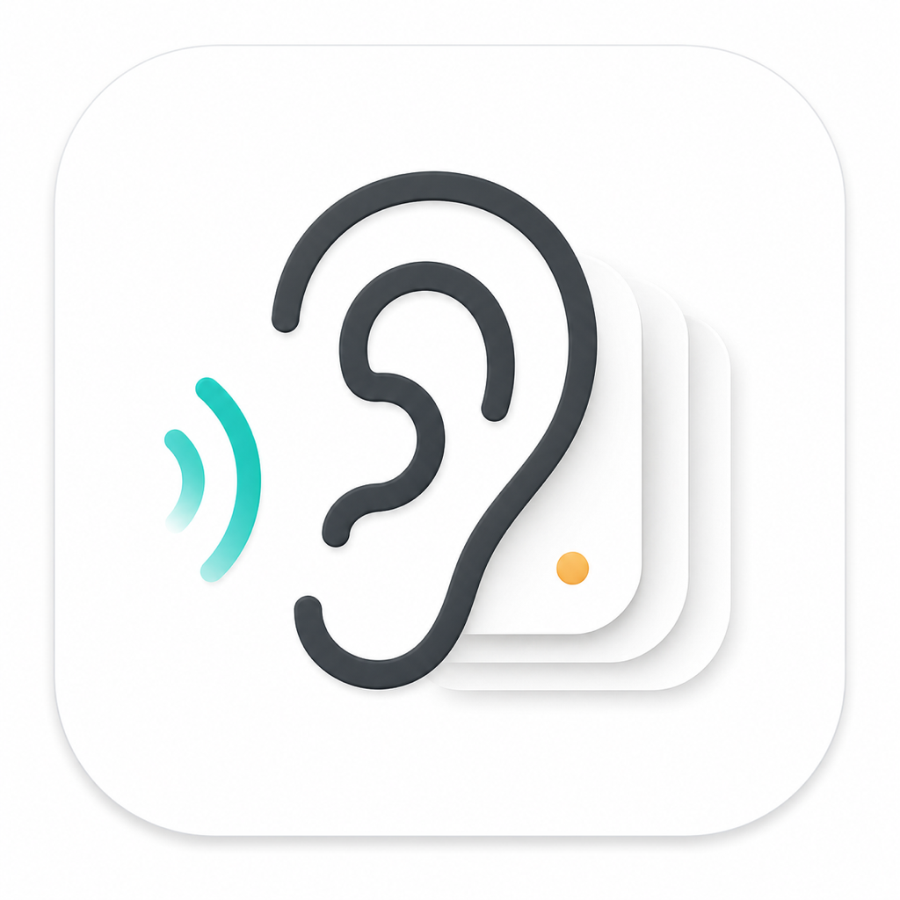

<p align="center">
  
</p>

<h1 align="center">Dob</h1>

<p align="center">
  <strong>过耳不忘的 AI 读写工具</strong>
  <br />
  让重要的信息经过你的大脑，留在你的电脑。
</p>

<p align="center">
  <a href="README.en.md">English / International Edition</a>
  ·
  <a href="https://github.com/Milktang0128/Dob/releases/latest">下载最新版</a>
</p>

---

**Dob** 是一款 macOS 原生菜单栏 App。它围绕一个很小的动作展开：选中一段文字，然后让它被朗读、解释、翻译、审校、比较、留档，必要时再回到你的记忆里。

它不是一个完整替代大模型聊天窗口的产品，而是一个贴在系统文本选择旁边的读写工具：你在浏览、写作、阅读 PDF、微信内置浏览器或任何应用里遇到重要内容时，不需要切换窗口，就能让 AI 帮你处理当前这段话。

## 下载与安装

已签名和公证的安装包发布在 GitHub Releases：

<https://github.com/Milktang0128/Dob/releases>

| 版本 | 最新安装包 | 说明 |
|---|---|---|
| 中文版 | `Dob-...-arm64.dmg` | 推荐大多数中文用户安装 |
| 国际版 | `Dob-International-...-arm64.dmg` | 英文界面和英文默认工作流 |

安装包已签名并通过 Apple 公证。Dob 会自动检查对应版本的更新，中文版和国际版不会互相更新。

首次使用：

1. 下载 DMG，打开后把 **Dob** 拖到 Applications。
2. 打开 Dob 后授予 **辅助功能** 权限：系统设置 -> 隐私与安全性 -> 辅助功能 -> 打开「Dob」。
3. 菜单栏图标 -> **服务管理...**，在「文本处理」里填写 API Key。默认模型预填 DeepSeek 推荐配置，也可以换成任何 OpenAI 兼容接口。
4. 选中任意应用里的文字，等待浮窗弹出，或按 `Option + Command + R` 手动呼出工具条。

没有 API Key 时，仍可使用朗读、OCR、复制、留档、历史和档案。AI 技能需要 OpenAI 兼容 Chat Completions API。

## 它能做什么

| 场景 | Dob 的处理方式 |
|---|---|
| 看一段陌生文本 | 选中后直接朗读、解释、翻译或提炼 |
| 写作时改一段文字 | 用「审校」直接得到修订后的版本 |
| 想看不同模型怎么回答 | 用「比较」在同一页上下分栏看最多三个模型输出 |
| 当前应用无法取词 | 用屏幕选框 OCR，或用输入面板手动粘贴 |
| 只想快速识别图片文字 | 用静默 OCR 复制，框选后直接进剪贴板 |
| 内容值得复习 | 点击留档，写入本地 Markdown 和 JSON |
| 只是临时查过 | 静默历史保留最近 500 条，不进入长期档案 |
| 不想在某个 App 自动弹出 | 在工具条更多菜单中按应用禁用，或全局禁用 |

## 核心功能

### 选中文本旁的工具条

选中文字后，Dob 会在屏幕边缘显示紧凑工具条。朗读固定在第一位；解释、翻译、提炼等技能可排序、禁用或放进更多菜单。

工具条支持键盘操作：

| 快捷键 | 动作 |
|---|---|
| `Esc` | 关闭 |
| `⌘R` | 重试当前技能 |
| `⌘C` | 复制结果 |
| `⌘S` | 留档 |
| `⌘P` | 固定窗口 |
| `⌘1` 到 `⌘5` | 触发前五个技能 |
| `⌘+` / `⌘-` | 调整结果字号 |

点击复制图标会立即复制，随后弹出一个轻量气泡，允许你顺手留档。

### 上下文感知

解释、翻译、提炼、洞见、审校和自定义技能默认会尽量读取当前文本控件或页面的可访问全文，把「选中内容 + 上下文」一起交给模型。

上下文不会粗暴全量入档。Dob 只在留档时保存选中内容上下各约 200 字，并用 Markdown 高亮标出选中内容：

```md
这是上文 ==真正选中的内容== 这是下文
```

如果本次回答成功使用了上下文，结果区会显示「已附带上下文」提示。设置里可以关闭「默认使用全文上下文」。

### 输入、OCR 和无法取词场景

Dob 提供三种兜底方式：

| 能力 | 默认快捷键 | 用途 |
|---|---|---|
| 输入面板 | `Control + Shift + I` | 呼出工具条和文本框，可粘贴或输入任意内容再处理 |
| 屏幕选框 OCR | `Control + Shift + O` | 框选屏幕区域识别文字，识别后打开工具条 |
| 静默 OCR 复制 | `Control + Shift + C` | 框选后直接复制识别结果，不显示工具条 |

屏幕 OCR 使用 Apple Vision 本地识别，不需要 API Key。你也可以开启「OCR 后执行最近一次技能」，连续 OCR 翻译、解释或朗读时更顺手。

### 技能系统

内置技能：

| 技能 | 默认状态 | 说明 |
|---|---|---|
| 朗读 | 开启 | 直接读出选中文本 |
| 解释 | 开启 | 用中文解释核心意思，默认 `Control + Shift + E` |
| 翻译 | 开启 | 中文译英文，其他语言译简体中文，默认 `Control + Shift + T` |
| 提炼 | 开启 | 提取核心结论，适合快速听懂 |
| 背景 | 关闭 | 补充理解当前文本所需背景 |
| 洞见 | 关闭 | 发掘更深层的意涵、价值和张力 |
| 盲点 | 关闭 | 查找观点、论证或方案的薄弱环节 |
| 审校 | 关闭 | 面向写作草稿，直接输出审校后的版本 |
| 助记 | 关闭 | 为文本设计更容易记住的助记法 |
| 精读 | 关闭 | 适合英文句子结构和关键词拆解 |

你可以新增最多 4 个自定义技能，为每个技能设置图标、提示词、启用状态、排序和全局快捷键。编辑技能时可以使用「AI 优化」让当前模型帮你改写提示词。

AI 技能默认完成后自动朗读；设置中可以关闭，让解释、翻译、审校等结果只显示不发声。朗读技能不受影响。

### 多模型比较

Dob 支持把同一个技能交给默认模型和最多两个备选模型比较。比较结果在一个页面上下分栏显示，默认模型会复用已有结果，不重复生成。

比较模型来自「服务」页面中启用并标记「参与比较」的 OpenAI 兼容服务商。

### 服务管理

服务页集中管理三类能力：

| 类别 | 支持 |
|---|---|
| 文本处理 | DeepSeek、OpenAI、自定义 OpenAI 兼容、Kimi、通义千问 / 百炼、智谱 GLM、火山方舟、SiliconFlow、Google Gemini、OpenRouter 等预设 |
| 文本识别 | Apple Vision 本地 OCR |
| 语音合成 | macOS 本地语音、火山引擎 TTS、Microsoft Speech、Google Text-to-Speech、腾讯云 TTS |

文本处理和语音合成服务都提供检测入口。语音生成处于准备阶段时，结果区会显示状态提示；云语音不可用时会回退到 macOS 本地语音。

中文版默认推荐火山引擎 TTS；完整音色列表以[火山引擎官方文档](https://www.volcengine.com/docs/6561/1257544?lang=zh)为准。

### 留档、历史和今日回响

Dob 把「主动留档」和「静默历史」分开：

| 类型 | 作用 | 保存内容 |
|---|---|---|
| 主动留档 | 长期复习和今日回响 | 原文、结果、来源、时间、动作、轻量上下文摘录 |
| 静默历史 | 临时回看最近动作 | 最近 500 条原文、结果、动作和来源，不保存全文上下文 |

Markdown 留档可选择到自己的目录，例如 Obsidian vault。设置页可以直接选择位置、在访达中显示，或恢复默认位置。

## 常用快捷键

| 动作 | 默认快捷键 |
|---|---|
| 呼出工具条 | `Option + Command + R` |
| 朗读 | `Control + Shift + R` |
| 解释 | `Control + Shift + E` |
| 翻译 | `Control + Shift + T` |
| 输入面板 | `Control + Shift + I` |
| 屏幕选框 OCR | `Control + Shift + O` |
| 静默 OCR 复制 | `Control + Shift + C` |
| 打开设置 | `Command + ,` |

每个技能都可以单独设置全局快捷键。

## 国际版

国际版面向英文用户，安装后 App 名称为 **Dob International**，见 [README.en.md](README.en.md)。

主要差异：

- 英文界面和英文默认技能名称。
- 默认本地 macOS 语音，降低首次使用门槛。
- 翻译默认目标是自然英文；如果原文已经是英文，则改写成更清晰自然的英文。

## 开发者构建

构建中文版：

```bash
./make-app.sh
open Dob.app
```

构建国际版：

```bash
FLAVOR=en ./make-app.sh
open "Dob International.app"
```

开发运行：

```bash
swift run
```

打包、公证和生成安装包：

```bash
./package-release.sh
```

## 已知边界

- 取词依赖 Accessibility 和模拟复制；少数禁用复制、跨进程隔离强或未暴露可访问文本的应用可能拿不到全文上下文。
- 屏幕 OCR 是兜底能力，识别质量取决于截图清晰度、语言和系统 Vision OCR。
- 浏览器来源会尽量保存可读页面信息；URL 默认去掉 query/hash，避免把追踪参数或私密参数写入档案。
- AI 技能依赖 OpenAI 兼容 Chat Completions API；不同服务商的模型名、限流和上下文长度以各自控制台为准。
- 云端语音服务需要在对应控制台开通并填写密钥；未配置或失败时会回退到 macOS 本地语音。
